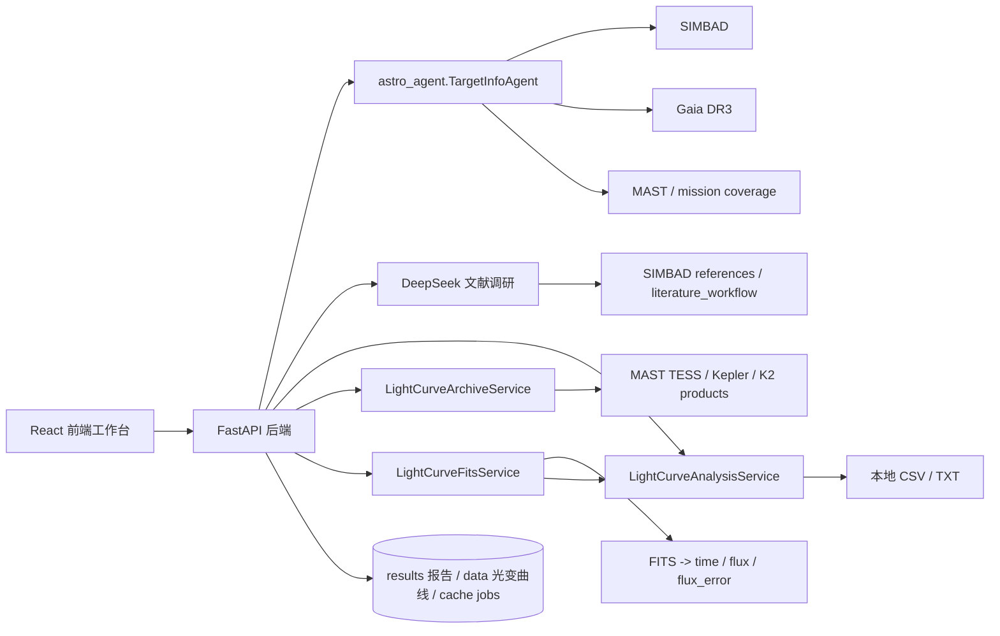

# 交互式目标信息与光变曲线工具架构

## 目标

将当前命令行批量检索项目改造为一个交互式 Web 工具：用户在前端输入目标名或坐标，后端复用现有 SIMBAD、Gaia、MAST、文献工作流能力返回结构化信息；用户可调用原项目 DeepSeek API 对目标 references 做文献调研；用户可加载或下载光变曲线，并在前端触发简单分析，包括去趋势、周期搜索和相位折叠可视化。

## 总体分层



## 当前新增骨架

- `backend/app/main.py`：FastAPI 应用入口，提供健康检查、目标查询、文献调研、光变曲线分析接口。
- `backend/app/services/target_service.py`：薄封装层，直接复用 `TargetInfoAgent.run_target()`，避免复制已有检索逻辑。
- `src/astro_agent/clients/deepseek_client.py`：保留原 DeepSeek chat completions 配置，并新增 `research_literature()` 用于 references 的独立文献调研。
- `backend/app/services/lightcurve_service.py`：首版本地光变曲线分析服务，支持有限点清洗、二阶多项式去趋势、归一化、Lomb-Scargle 周期搜索和相位折叠。
- `backend/app/services/lightcurve_archive_service.py`：MAST 光变曲线归档服务，按目标坐标检索 TESS/Kepler/K2 timeseries 产品，筛选 light curve FITS，并下载到结构化数据目录。
- `backend/app/services/lightcurve_fits_service.py`：FITS 分析准备层，读取 `manifest.json` 中的本地 FITS，选择 `PDCSAP_FLUX`、`SAP_FLUX` 等通量列，按 `QUALITY == 0` 做质量过滤，转成统一点列，并可直接调用数值分析层。
- `frontend/`：Vite + React 工作台，包含目标查询面板、DeepSeek 文献调研面板、光变曲线上传入口、曲线图、周期指标和相位图。

## API 设计

### `GET /api/health`

用于前端或部署层探活。

### `POST /api/targets/query`

请求：

```json
{
  "target": "AD Leo",
  "use_llm": false,
  "force_refresh": false
}
```

默认 `force_refresh=false` 时，后端会优先载入 `results/<target>.json` 已有结果，返回 `source="results"` 和 `result_path`。当 `force_refresh=true` 时，后端跳过本地结果，重新调用 SIMBAD/Gaia/MAST/DeepSeek 流程，并把新结果写回 `results/<target>.json`。

### `POST /api/literature/research`

请求来自前端当前目标结果中的 `target.simbad.references` 和 `target.literature_workflow`，文字分析调用 `config.yaml` 中配置的 DeepSeek API。

```json
{
  "target": "AD Leo",
  "target_type": "stellar",
  "references": [],
  "literature_workflow": {},
  "focus_question": "重点关注光变曲线、周期和恒星活动。"
}
```

响应：

```json
{
  "generated_at": "2026-07-06T00:00:00+00:00",
  "target": "AD Leo",
  "reference_count": 120,
  "report": "DeepSeek 生成的中文文献调研报告"
}
```

响应保持与现有结果文件一致：

```json
{
  "generated_at": "2026-07-06T00:00:00+00:00",
  "target": {
    "query_target": "AD Leo",
    "simbad": {},
    "gaia": {},
    "mast": {},
    "literature_workflow": {},
    "notes": []
  }
}
```

### `POST /api/lightcurves/analyze`

请求：

```json
{
  "points": [
    {"time": 0.0, "flux": 1.0},
    {"time": 0.1, "flux": 0.99},
    {"time": 0.2, "flux": 1.01}
  ],
  "detrend": {"enabled": true, "method": "polynomial", "polynomial_order": 2},
  "period_search": {"enabled": true, "samples_per_peak": 8}
}
```

响应包含：清洗后的点数、时间跨度、通量统计、归一化曲线、最佳周期、false alarm probability、相位折叠曲线。

### `POST /api/lightcurves/search`

按目标坐标或目标名检索 MAST 中 TESS、Kepler、K2 的 light curve FITS 产品。

```json
{
  "target": "AD Leo",
  "ra_deg": 154.9008,
  "dec_deg": 19.8700,
  "radius_deg": 0.02,
  "missions": ["TESS", "Kepler", "K2"],
  "max_products": 80
}
```

### `POST /api/lightcurves/download`

下载检索到的产品。若传入 `product_uris`，只下载选中产品；否则按 `max_downloads` 下载前几个候选。

```json
{
  "target": "AD Leo",
  "ra_deg": 154.9008,
  "dec_deg": 19.8700,
  "radius_deg": 0.02,
  "missions": ["TESS"],
  "product_uris": ["mast:TESS/product.fits"],
  "max_downloads": 5
}
```

### `POST /api/lightcurves/load`

从已下载目录读取 FITS 并转成统一点列。默认优先使用 `PDCSAP_FLUX`，其次 `SAP_FLUX`、`KSPSAP_FLUX`、`DET_FLUX`、`FLUX`。

```json
{
  "download_dir": "data/lightcurves/AD Leo/20260706T084544Z",
  "quality_filter": true,
  "max_points": 5000
}
```

### `POST /api/lightcurves/analyze-dataset`

对已下载 FITS 数据集执行完整分析：FITS 解析、质量过滤、抽样、去趋势、周期搜索和相位折叠。

```json
{
  "download_dir": "data/lightcurves/AD Leo/20260706T084544Z",
  "quality_filter": true,
  "max_points": 5000,
  "detrend": {"enabled": true, "method": "polynomial", "polynomial_order": 2},
  "period_search": {"enabled": true, "samples_per_peak": 8}
}
```

## 数据模型与存储

首版保持无数据库：目标查询结果直接返回给前端，已有 CLI 仍继续写 `results/`。数据目录职责如下：

- `results/`：人类可读报告和目标查询 JSON。Web 目标查询默认从这里直接载入已有信息；强制重新检索后也会把最新 JSON 写回这里。后续不再放下载的光变曲线原始产品。
- `data/lightcurves/<target>/<YYYYMMDDTHHMMSSZ>/`：MAST 下载的 FITS 产品、`selected_products.json` 和 `manifest.json`。该目录默认被 git 忽略，只保留 `.gitkeep`。
- `cache/`：后续可放目标查询缓存和异步 job 状态，目前未启用。

下一阶段建议新增：

- `cache/targets/<safe-target>.json`：缓存目标信息，避免重复调用 SIMBAD/Gaia/MAST。
- `cache/lightcurves/<target>/<mission>.parquet`：从 FITS 解析后的轻量曲线缓存。
- `cache/jobs/<job-id>.json`：记录长任务状态，支持前端轮询。

当目标查询和光变曲线下载变慢时，再引入 SQLite 或 DuckDB 存索引，不必一开始就上完整数据库。

## 光变曲线路线

第一阶段已经可处理本地上传：`time flux [flux_error]` 的 CSV 或空白分隔文本。同时已经支持从 MAST 自主检索并下载 TESS、Kepler、K2 光变曲线 FITS 产品。

当前归档下载路径：

1. 在 MAST 查询结果里暴露 TIC/EPIC/KIC 和 mission coverage。
2. `LightCurveArchiveService` 按目标坐标检索 MAST timeseries 产品。
3. 后端筛选 `LC`、`LLC`、`SLC` 等 light curve FITS 产品。
4. 前端展示候选产品，用户可选择并下载。
5. 后端写入 `data/lightcurves/<target>/<run-id>/manifest.json`，记录下载目录、mission、产品和本地路径。
6. 后端立即把下载的 FITS 解析为 `lightcurve.csv`，列为 `time,flux,flux_error`，并把 CSV 路径回填到 manifest。

FITS 解析层已经可以把下载产品统一解析为内部点列：`time`、`flux`、`flux_error`，生成可复用 CSV，并把结果直接送入现有分析接口。分析接口同时返回 Lomb-Scargle periodogram，前端独立光变页面用它绘制频谱图，并允许点击频谱峰或手动输入周期来重算相位折叠。下一步可继续扩展 `quality`、`mission`、`sector/quarter/campaign` 元数据，并支持多产品合并策略选择。

## 前端工作流

1. 输入目标名或坐标；默认优先载入 `results/` 已有信息，勾选“强制重新检索”才重新访问外部数据库。
2. 查看 SIMBAD/Gaia/MAST/文献信息和数据覆盖。
3. 在“文献调研”面板输入关注问题，调用 DeepSeek 基于 references 输出研究主题、观测资料、关键结论、缺口和后续关键词。
4. 切换到独立“光变曲线”页面，检索 MAST 产品，选择并下载 FITS 到 `data/lightcurves/`。
5. 在“已下载数据集”中选择新下载或历史下载的数据集并分析，或上传本地 `time flux [err]` 文本。
6. 选择周期搜索范围和 `samples_per_peak`。
7. 查看去趋势曲线、Lomb-Scargle 频谱、周期指标和相位图；可用最佳周期、点击频谱峰或手动输入周期来合并相位。

## 清理策略

已清理本地生成物与旧敏感残留：`__pycache__/`、`.DS_Store`、`frontend/dist/`、`MyAPI.key`、`start_agent_with_key.py`。保留 `src/astro_agent/`、`run_agent.py` 和 `results/`：后端仍复用 `src/astro_agent/` 的检索逻辑，CLI 可作为批处理/回归验证入口，`results/` 可作为已有目标样例和后续缓存迁移参考。

## 推荐实施顺序

1. 后端 API 与前端工作台骨架：已完成。
2. DeepSeek 文献调研接口与前端面板：已完成。
3. MAST 光变曲线产品检索、下载和结构化落盘：已完成。
4. FITS 解析层与下载数据分析：已完成。
5. 增加目标查询缓存，降低交互等待时间。
6. 将光变曲线分析接口扩展为任务式接口，支持长时间下载和处理。
7. 增加多 sector 合并、质量位过滤、binning、手动周期输入和导出。
8. 增加测试：目标查询 smoke test、文献调研 mock test、上传曲线分析单元测试、前端构建检查。

## 运行方式

后端：

```bash
.venv/bin/uvicorn backend.app.main:app --reload --host 127.0.0.1 --port 8000
```

前端：

```bash
cd frontend
npm install
npm run dev
```

前端默认访问 `http://127.0.0.1:8000`。如需改后端地址，可设置 `VITE_API_BASE`。
